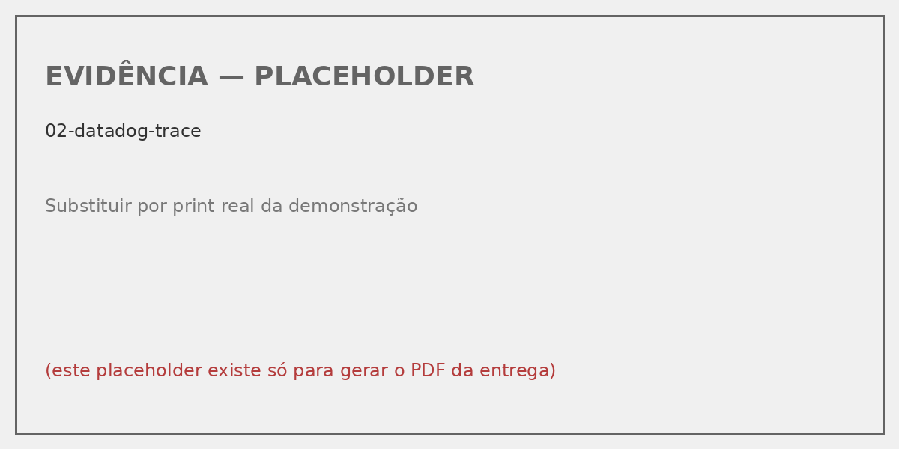
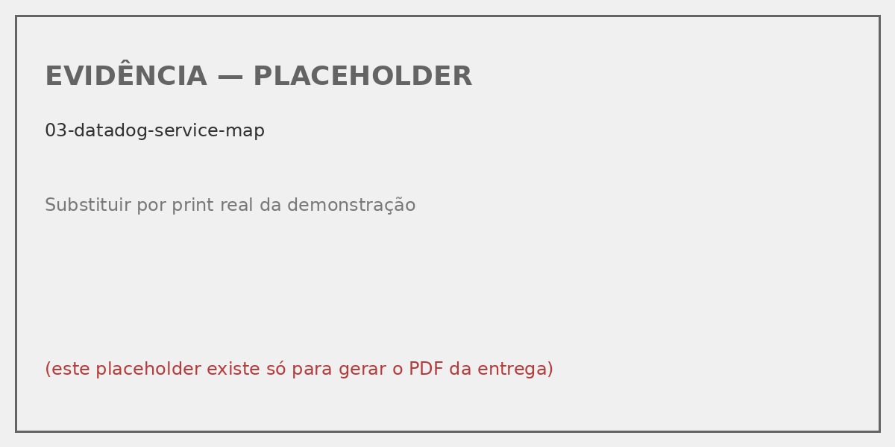
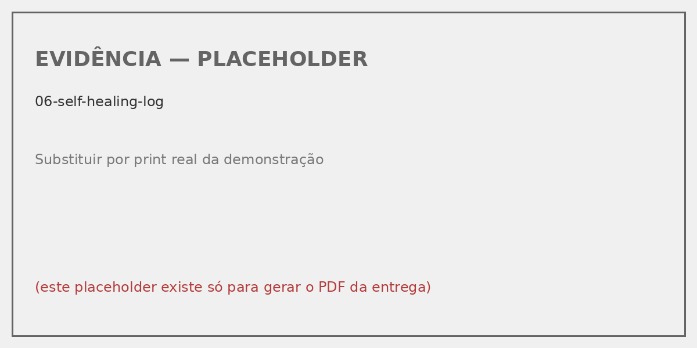

# 1. Identificação

> ⚠️ **PREENCHER ANTES DE ENTREGAR** — substitua os campos abaixo com os dados reais do grupo.

| Campo | Valor |
|---|---|
| **Grupo** | (nome do grupo) |
| **Integrante 1** | Nome / RM xxxxx / @username |
| **Integrante 2** | Nome / RM xxxxx / @username |
| **Integrante 3** | Nome / RM xxxxx / @username |
| **Repositório (código)** | https://github.com/SEU-USUARIO/togglemaster-fase4 |
| **Vídeo de demonstração** | https://youtu.be/SEU-VIDEO (≤ 25 min) |

\newpage

# 2. Resumo executivo

A Fase 4 instrumenta a stack do ToggleMaster (5 microsserviços rodando em AWS EKS via GitOps) com observabilidade fim-a-fim usando OpenTelemetry como peça central, Prometheus + Loki + Grafana como base open-source, Datadog como APM comercial, e PagerDuty + Discord + um webhook Python in-cluster para resposta automatizada a incidentes (self-healing).

Tudo entregue por GitOps: a stack inteira sobe via 2 `Application` adicionais no ArgoCD (`observability-stack` e `self-healing-webhook`).

# 3. Stack e ferramentas escolhidas

| Camada | Ferramenta | Status |
|---|---|---|
| Coleta unificada | **OpenTelemetry Collector** (contrib) — DaemonSet | Obrigatório (atendido) |
| Métricas | Prometheus (via `kube-prometheus-stack`) | Atendido |
| Logs | Loki (SingleBinary) | Atendido |
| Dashboards | Grafana (dashboard customizado provisionado por ConfigMap) | Atendido |
| APM | **Datadog** (Cluster Agent + Node Agent) | Atendido |
| Gerência de incidentes | **PagerDuty** (Developer plan) | Atendido |
| ChatOps | **Discord** (via PagerDuty extension) | Atendido |
| Self-Healing | Webhook Python in-cluster (`kubectl rollout restart` via API K8s) | Atendido |

\newpage

# 4. Arquitetura

```
┌──────────────── AWS EKS (togglemaster-eks) ──────────────────────────┐
│                                                                       │
│  ┌── Namespaces de aplicação (Fase 3) ──────────────────┐            │
│  │ auth, flag, targeting, evaluation, analytics         │            │
│  │ - Cada pod expõe :9464/metrics (Prometheus)          │            │
│  │ - Cada pod envia OTLP/HTTP -> OTel Collector         │            │
│  └──────────────────┬───────────────────────────────────┘            │
│                     │ OTLP                                            │
│                     ▼                                                 │
│  ┌── Namespace: observability (NOVO) ───────────────────┐            │
│  │                                                       │            │
│  │  OpenTelemetry Collector (DaemonSet)                 │            │
│  │   ├── recebe OTLP dos microsserviços                 │            │
│  │   ├── lê /var/log/pods                               │            │
│  │   ├── enriquece com k8sattributes                    │            │
│  │   └── ROTEIA:                                        │            │
│  │         ├── traces  → Datadog APM                    │            │
│  │         ├── métricas → Prometheus                    │            │
│  │         └── logs    → Loki                           │            │
│  │                                                       │            │
│  │  Prometheus + Grafana + Alertmanager + Loki + DD     │            │
│  │  Self-Healing Webhook (pod Python)                   │            │
│  └──────────────────┬───────────────────────────────────┘            │
└─────────────────────┼─────────────────────────────────────────────────┘
                      ▼
        Alertmanager → PagerDuty → ┬─→ Discord (notify)
                                    └─→ Self-Healing /heal (action)
                                          │
                                          ▼
                                    kubectl rollout restart
                                    deployment/<service>
```

# 5. Justificativas técnicas

## 5.1 Por que OTel Collector como peça central?

Além de ser exigência do enunciado, é a decisão arquiteturalmente correta: trocar Datadog por New Relic amanhã exigiria mexer apenas no exporter do Collector — nenhum código de aplicação muda. Vendor lock-in fica isolado em um único componente.

## 5.2 Datadog vs New Relic — escolha de Datadog

| Critério | Datadog | New Relic |
|---|---|---|
| Plano educational | ✅ For Education | ⚠️ Trial limitado |
| Service Map | ✅ Excelente (latência inline) | ✅ Bom, UI mais complexa |
| Integração K8s | ✅ Cluster Agent maduro | ⚠️ Mais config manual |
| Compatibilidade OTLP | ✅ Exporter no contrib | ✅ Via OTLP nativo |

## 5.3 PagerDuty vs OpsGenie — escolha de PagerDuty

| Critério | PagerDuty | OpsGenie |
|---|---|---|
| Plano gratuito | ✅ Developer ilimitado | ⚠️ Free até 5 users |
| Extensão Discord | ✅ Webhook genérico nativo | ⚠️ Requer Zapier |
| Webhook custom (self-heal) | ✅ Built-in | ✅ Via Actions (mais complexo) |

## 5.4 Por que Discord via PagerDuty (e não direto do Alertmanager)?

Para manter o incidente como **single source of truth** com MTTA/MTTR auditáveis. Se Discord recebesse de duas fontes, teríamos notificação duplicada e métricas de SRE distorcidas.

\newpage

# 6. Evidências visuais

> ⚠️ **INSTRUÇÕES PARA O GRUPO**: substitua cada placeholder abaixo pelo print correspondente, na ordem em que demonstrar no vídeo. Os arquivos devem ficar em `docs/fase4/evidencias/`.

## 6.1 Dashboard do Grafana

{ width=100% }

**O que mostrar:** dashboard "ToggleMaster — Visão Geral (Fase 4)" com as 5 linhas — estado dos serviços, RPS por serviço, erros 5xx, recursos do cluster e logs do Loki filtráveis.

## 6.2 Trace distribuído no APM (Datadog)

{ width=100% }

**O que mostrar:** uma chamada ao endpoint `/evaluate` percorrendo os 3 microsserviços, com tempos de cada span, status code, e atributos do K8s (`k8s.deployment.name`, `k8s.pod.name`).

## 6.3 Service Map no Datadog

{ width=100% }

**O que mostrar:** os 5 nós (`auth-service`, `evaluation-service`, `flag-service`, `targeting-service`, `analytics-service`) com as setas indicando as dependências reais detectadas via propagação de `traceparent`.

\newpage

## 6.4 Incidente aberto no PagerDuty

{ width=100% }

**O que mostrar:** o incidente com status "Triggered", severity "Critical", e os detalhes do alerta (alertname, namespace, service, runbook_url).

## 6.5 Notificação no Discord

{ width=100% }

**O que mostrar:** o card do PagerDuty no Discord com cor vermelha, summary do alerta e link para o incidente.

## 6.6 Log de execução do Self-Healing

{ width=100% }

**O que mostrar:** linha de log estruturado JSON com `msg: "auto_heal_executed"`, `service: "evaluation-service"`, `action: "rollout-restart"`, `ok: true`, e timestamp.

## 6.7 Pods reiniciando após o Self-Healing

{ width=100% }

**O que mostrar:** `kubectl get pods -n evaluation-namespace -w` capturando o rolling restart em ação.

\newpage

# 7. Mapeamento dos requisitos → entregáveis

| Requisito Fase 4 | Local no repositório |
|---|---|
| Prometheus para métricas | `gitops/base/observability/01-kube-prometheus-stack.yaml` |
| Loki para logs | `gitops/base/observability/02-loki.yaml` |
| Grafana com dashboard custom | `gitops/base/observability/07-grafana-dashboard.yaml` |
| OTel Collector | `gitops/base/observability/03-otel-collector.yaml` |
| APM (Datadog) | `gitops/base/observability/04-datadog.yaml` |
| Instrumentação Python | `services/{flag,targeting,analytics}-service/telemetry.py` |
| Instrumentação Go | `services/{auth,evaluation}-service/telemetry/*.go` |
| Distributed Tracing | `WrapTransport` em `telemetry.go` + `HttpClient` do evaluation-service |
| Service Map | OTel → Datadog (todos os 5 com `DD_SERVICE` setado) |
| Alerta inteligente | `gitops/base/observability/06-prometheus-rules.yaml` (`HighHttpErrorRate`) |
| Integração PagerDuty | `gitops/base/observability/05-alertmanager-config.yaml` |
| Discord notification | PagerDuty Service Extension (config fora do Git) |
| Self-Healing automático | `services/self-healing-webhook/main.py` + `gitops/base/self-healing/` |

# 8. Documentos complementares no repositório

| Documento | Conteúdo |
|---|---|
| `docs/fase4/CHANGES.md` | Changelog técnico detalhado (Fase 3 → Fase 4) |
| `docs/fase4/ARCHITECTURE.md` | Mergulho técnico nos 3 sinais (traces, metrics, logs) e RBAC |
| `docs/fase4/DEPLOYMENT.md` | Passo-a-passo de deploy no AWS Academy |
| `docs/fase4/RELATORIO.md` | Este relatório (.md fonte) |
